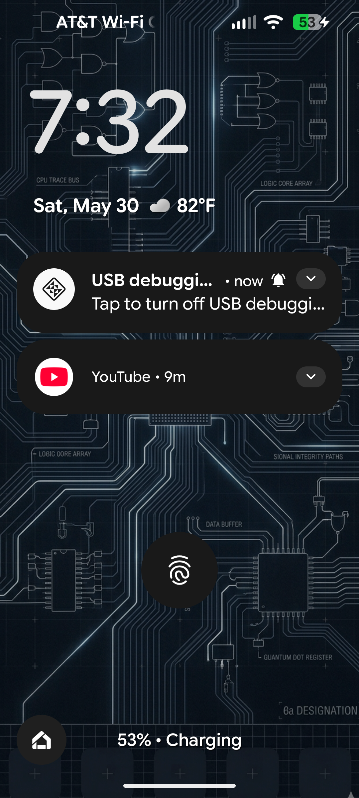
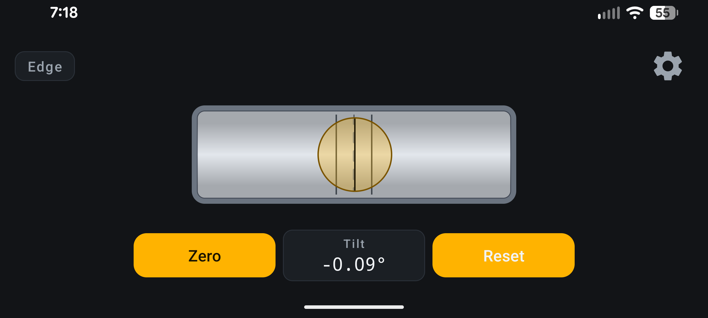

# Level

An ad-free, open-source bubble level for Android. Two modes auto-switch based on
how you set the phone down:

- **Surface** — phone flat on its back, round bubble with roll + pitch readouts
- **Edge** — phone resting on a long edge, horizontal torpedo level with a tilt readout

The bubble travels with a heavy averaging filter so the readings are stable
enough for picture-frame work, and either mode can be zeroed independently so
you can use one surface as a reference and move to another.

## Screenshots

| Surface mode | Edge mode |
|:---:|:---:|
|  |  |

## Features

- Auto-detects which mode to use based on the accelerometer
- Round bubble level (surface) with independent roll/pitch zero
- Torpedo level (edge) with independent tilt zero — landscape layout that
  rotates with the phone
- Per-axis alignment glow when each axis is within a user-configurable tolerance
- Whole-instrument green-bezel indicator when fully level
- Crystal-dome magnify effect: background guide lines appear larger and faded
  inside the bubble for fine alignment
- Optional invert-roll / invert-pitch toggles in Settings to fix any
  device-specific direction mismatch
- All settings persist across sessions
- No ads, no trackers, no internet permission, no analytics

## Install

Grab `app-release.apk` from the [latest release](https://github.com/parachute-lemming/LevelAppForAndroid/releases/latest),
copy it to your Android phone, and tap to install. You'll need to allow your
file manager or browser to install apps from unknown sources the first time
Android prompts.

Minimum Android 8.0 (API 26).

## Build from source

Requirements: Android Studio (Ladybug / 2024.2 or newer is fine), JDK 17,
Android SDK with build-tools 36.

```bash
git clone https://github.com/parachute-lemming/LevelAppForAndroid.git
cd LevelAppForAndroid
./gradlew :app:assembleDebug
```

Output: `app/build/outputs/apk/debug/app-debug.apk`.

For a release build you'll need your own keystore. Set these in your
`~/.gradle/gradle.properties` (outside the repo):

```
LEVEL_KEYSTORE_FILE=/absolute/path/to/your.keystore
LEVEL_KEYSTORE_PASSWORD=...
LEVEL_KEY_ALIAS=...
LEVEL_KEY_PASSWORD=...
```

Then:

```bash
./gradlew :app:assembleRelease
```

If those properties are absent the release build falls back to the debug
signing config — it will still build, just signed with your local debug key.

## License

Apache License 2.0 — see [LICENSE](LICENSE).
